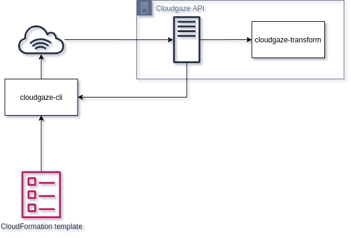

.. Cloudgaze documentation master file, created by
   sphinx-quickstart on Sun May 10 21:43:33 2020.
   You can adapt this file completely to your liking, but it should at least
   contain the root `toctree` directive.

Welcome to Cloudgaze's documentation!
=====================================

Cloudgaze is a service which takes your AWS CloudFormation template files and converts them into draw.io compatible XML.

Cloudgaze consists of a few different services which ties everything together:

   Overview of Cloudgaze architecture

   The cloudgaze-cli can be downloaded from `PyPI <https://pypi.org/project/cloudgaze-cli/>`_.

.. toctree::
   :maxdepth: 2
   :caption: Contents:

Indices and tables
==================

* :ref:`genindex`
* :ref:`search`

Cloudgaze API
=============

Currently the API can only be access through the :ref:`Cloudgaze CLI`.

Cloudgaze CLI
=============

Currently the only provided tool which can convert CloudFormation template to Draw.IO diagrams. The tool makes calls to
the :ref:`Cloudgaze API` with the provided template file.

Privacy
=======

Data sent to the Cloudgaze API is never logged, or otherwise stored anywhere on the Cloudgaze servers. No user data is
logged either. The only metrics that are logged are the number of calls, and the execution time of the conversion.