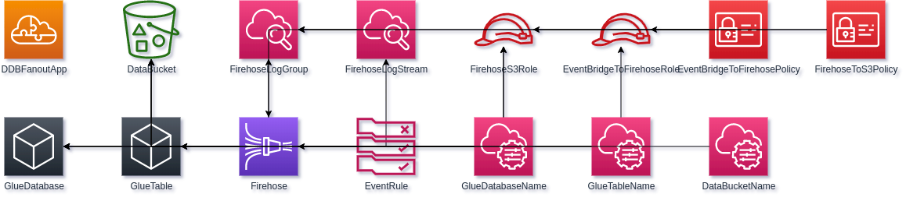

.. Cloudgaze documentation master file, created by
   sphinx-quickstart on Sun May 10 21:43:33 2020.
   You can adapt this file completely to your liking, but it should at least
   contain the root `toctree` directive.

Welcome to Cloudgaze's documentation!
=====================================

Cloudgaze is a service which takes your AWS CloudFormation template files and converts them into draw.io compatible XML.

.. toctree::
   :maxdepth: 2
   :caption: Contents:

Indices and tables
==================

* :ref:`genindex`
* :ref:`search`

Cloudgaze Service
=================

The service consists of several different components which ties everything together:

.. figure:: _static/images/overview_arch.png
   :alt: Architectural overiew

   Overview of Cloudgaze architecture

.. list-table:: Components

   *  - cloudgaze-cli
      - Python script which calls the Cloudgaze API. Available for download from `PyPi <https://pypi.org/project/cloudgaze-cli/>`_.
   *  - cloudgaze-transform
      - Enables the transformation between CloudFormation syntax and Draw.IO XML format.
   *  - Cloudgaze API
      - Public API which orchestrates everything together.

Cloudgaze API
=============

Currently the API can only be access through the :ref:`Cloudgaze CLI`.

Cloudgaze CLI
=============

Currently the only provided tool which can convert CloudFormation template to Draw.IO diagrams. The tool makes calls to
the :ref:`Cloudgaze API` with the provided template file.

Examples
--------

Given the input file at the public `AWS Realworld Serverless Application repository <https://github.com/awslabs/realworld-serverless-application/blob/master/analytics/sam/app/template.yaml>`_, will output an XML-file
which opened in Draw.IO will look like the following:

   Output opened in draw.io

The output have arrows connecting any found dependencies, where the arrow head is at the resource of which another resource is dependant on. For example, in the above image, the resource *Firehose* is dependant on the resource *FirehoseLogGroup* in someway. In this particular case, it's because it references the log group, as can be found in this part of the code:

.. code-block:: yaml
   :emphasize-lines: 13
   :linenos:
   :lineno-start: 183

   Firehose:
    Type: AWS::KinesisFirehose::DeliveryStream
    DependsOn: FirehoseToS3Policy
    Properties:
      DeliveryStreamType: DirectPut
      ExtendedS3DestinationConfiguration:
        BucketARN: !GetAtt DataBucket.Arn
        BufferingHints:
          IntervalInSeconds: 60
          SizeInMBs: 128
        CloudWatchLoggingOptions:
          Enabled: true
          LogGroupName: !Ref FirehoseLogGroup

Dependencies and References
---------------------------

As seen above, Cloudgaze can identify and connect resources which have dependencies to another resource. This is currently limited to resources in the same stack, and in reality. The following CloudFormation keywords are supported:

.. list-table::

   *  - !Sub and Fn::Sub
      - Either by using it stand alone or as part of a longer string
   *  - !GetAtt and Fn::GetAtt
      - The dependency will be to the resource, not the "output". For instance, *!GetAtt Resource.Arn* will create a dependency to the resource *Resource*
   *  - !Ref and Ref
      -

Privacy
=======

Data sent to the Cloudgaze API is never logged, or otherwise stored anywhere on the Cloudgaze servers. No user data is
logged either. The only metrics that are logged are the number of calls, and the execution time of the conversion.